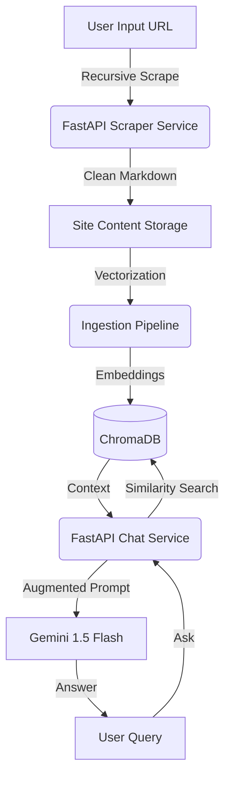

# WebScraper & RAG Pipeline: Intelligent Site Intelligence

[](https://www.python.org/)
[](https://fastapi.tiangolo.com/)
[](https://streamlit.io/)
[](https://www.trychroma.com/)
[](https://deepmind.google/technologies/gemini/)
[](https://www.docker.com/)

**WebScraper & RAG Pipeline** is a sophisticated, full-stack multi-agent system designed to extract high-quality knowledge from any website and transform it into an interactive, context-aware AI Knowledge Base.

---

##  Why This Project?

In the era of LLMs, the most valuable asset is **proprietary data**. This project demonstrates an end-to-end engineering solution to the "Data Ingestion Gap" by:
1.  **Mining**: Deep recursive scraping of complex site structures.
2.  **Structuring**: Converting noisy HTML into clean, semantic Markdown.
3.  **Synthesizing**: Building a high-dimensional vector store for sub-second retrieval.
4.  **Conversing**: Implementing a RAG (Retrieval-Augmented Generation) pipeline that answers questions with **zero hallucinations** based solely on the scraped source.

---

## Technical Architecture

The system is built with a modular service-oriented architecture, ensuring scalability and ease of deployment.



---

## Key Features

### 1. Advanced Web Scraper
- **Recursive Depth Management**: Supports both BFS and DFS strategies with domain-locking.
- **Fault-Tolerant**: Handles timeouts, redirects, and nested structures gracefully.
- **Smart Formatting**: Leverages `crawl4ai` and `markdownify` for clean, LLM-ready context.

### 2. Intelligent RAG Engine
- **Hybrid Embeddings**: Automatically downloads `all-MiniLM-L6-v2` locally if no custom model is provided—ensuring instant portability.
- **Context Retrieval**: Uses cosine similarity across ChromaDB to pull only the most relevant snippets.

### 3. Professional Suite of UIs
- **Researcher Frontend**: Dedicated interface for managing crawls and visualizing site mapping.
- **Assistant Frontend**: A ChatGPT-style interaction portal with session statistics and chat history.

---

##  Quick Start

### Option A: Docker Compose (Recommended)
Launch the entire ecosystem (2 Backends, 2 Frontends) with one command:
```bash
docker-compose up --build
```
- **Chat UI**: http://localhost:8501
- **Scraper UI**: http://localhost:8502

### Option B: Local Setup
1. **Prepare Environment**:
   ```bash
   pip install -r requirements.txt
   cp .env.example .env
   ```
2. **Launch Backends**:
   ```bash
   python src/api/scraper_endpoints.py  # Port 5005
   python src/api/chat_api.py           # Port 5003
   ```
3. **Launch Frontends**:
   ```bash
   streamlit run src/frontend/scraper_interface.py --server.port 8502
   streamlit run src/frontend/chat_interface.py --server.port 8501
   ```

---

## Project Structure
```text
src/
├── scraper/        # Deep crawling & Link frontier logic
├── vectorstore/    # Embedding & ChromaDB management
├── rag/            # Retrieval logic & LLM orchestration
├── api/            # FastAPI microservices
├── frontend/       # Streamlit professional interfaces
└── utils/          # Global config & logging
```

---

##  Future Roadmap
- [ ] Support for PDF and Docx ingestion in the same pipeline.
- [ ] Visual sitemap generation
