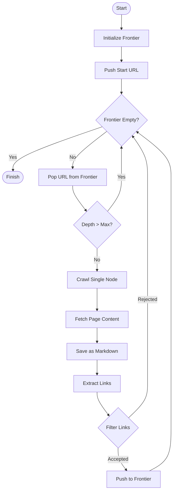

# Web Scraper Documentation

## Overview
The Web Scraper component is a robust, recursive crawling engine designed to traverse websites, extract content, and save it as clean Markdown files. It powers the RAG pipeline by providing the raw knowledge base.

## Folder Structure
The core logic resides in `src/scraper/`:

```text
src/scraper/
├── __init__.py
├── scraper.py          # Single-page scrape logic (fetches & saves)
├── recursion.py        # Recursive crawling logic (The "Driver")
├── frontier.py         # URL Frontier (Queue/Stack) & Deduplication
├── pagination.py       # Next-page detection & handling
├── extractor.py        # Content extraction (via Crawl4AI)
└── markdown_saver.py   # File I/O (Save to sitecontent/)
```

## Detailed Workflow

The scraper operates on a **Frontier-based Recursive Model**. It maintains a list of URLs to visit (the Frontier) and processes them one by one.

### Scraper Logic Diagram



### How BFS vs. DFS Works
The difference lies in how the **Frontier** stores and retrieves URLs:

1.  **BFS (Breadth-First Search)**:
    *   **Mechanism**: Uses a **Queue** (FIFO - First In, First Out).
    *   **Behavior**: It finishes all pages at Depth 1 before moving to Depth 2.
    *   **Use Case**: Best for getting a broad overview of a site (e.g., Home, About, Services) without getting stuck deep in one blog archive.
    *   **Implementation**: New links are added to the *back* of the list; we pop from the *front*.

2.  **DFS (Depth-First Search)**:
    *   **Mechanism**: Uses a **Stack** (LIFO - Last In, First Out).
    *   **Behavior**: It follows one path as deep as possible (Depth 1 -> 2 -> 3...) before backtracking.
    *   **Use Case**: Good if you want to fully explore a specific section immediately.
    *   **Implementation**: New links are added to the *front* (or back, depending on pop logic); we pop the *newest* item first.

In `src/scraper/frontier.py`, this is handled by the `pop()` method:
- **BFS**: `self.queue.pop(0)`
- **DFS**: `self.queue.pop()`

## Parameters & Configuration

The `recursive_crawl` function accepts several parameters that control the scope and behavior of the scrape.

| Parameter | Type | Default | Description |
| :--- | :--- | :--- | :--- |
| `start_url` | `str` | Required | The entry point URL for the crawl. |
| `strategy` | `str` | `"bfs"` | **BFS** (Breadth-First) or **DFS** (Depth-First). Controls the order of traversal. |
| `max_depth` | `int` | `2` | How many "clicks" away from the start URL to go. Depth 0 is the start page. |
| `max_pages_per_url` | `int` | `5` | **Pagination Limit**. If a page has "Next" buttons, how many pages of that sequence to scrape. |
| `max_total_pages` | `int` | `200` | **Global Safety Cap**. Stops the scraper after saving this many total pages, regardless of depth. |
| `max_total_nodes` | `int` | `100` | **Frontier Limit**. Stops adding new URLs to the frontier after it has tracked this many unique nodes. |
| `same_domain_only` | `bool` | `True` | If `True`, the scraper ignores links pointing to external domains (e.g., twitter.com, linkedin.com). |

## Role in the Workflow

1.  **Data Acquisition**: The scraper is the very first step. It goes out to the live web and brings back raw data.
2.  **Normalization**: It converts messy HTML into clean, structured **Markdown**. This is crucial because LLMs understand Markdown structure (headers, lists) very well.
3.  **Organization**: It saves files in a hierarchical folder structure in `sitecontent/`, preserving the website's logical structure (e.g., `sitecontent/example-com/blog/post-1.md`).
4.  **Input for RAG**: These Markdown files are the direct input for the **Ingestion Pipeline**, which turns them into vectors for the chatbot.

## Usage Examples

### 1. Broad Scan (BFS)
Get the main pages of a site.
```bash
python src/main.py --url https://example.com --strategy bfs --max-depth 2
```

### 2. Deep Dive (DFS)
Explore a specific section deeply.
```bash
python src/main.py --url https://example.com/blog --strategy dfs --max-depth 5
```

### 3. API Request
Trigger a scrape programmatically.
```bash
curl -X POST "http://localhost:5005/scrape" \
     -H "Content-Type: application/json" \
     -d '{"url": "https://example.com", "strategy": "bfs", "max_depth": 2}'
```
